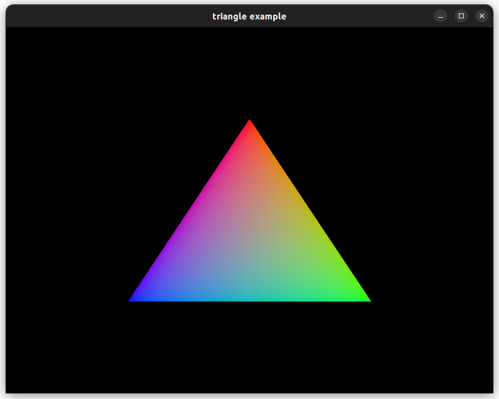
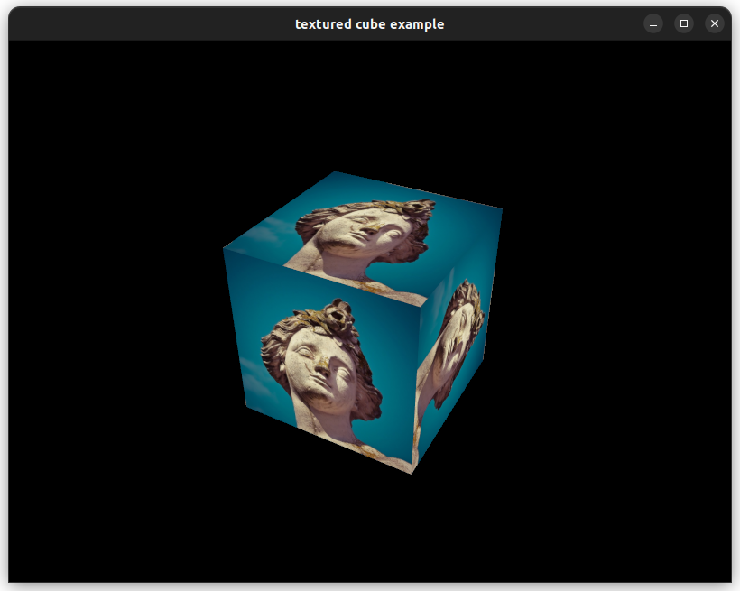
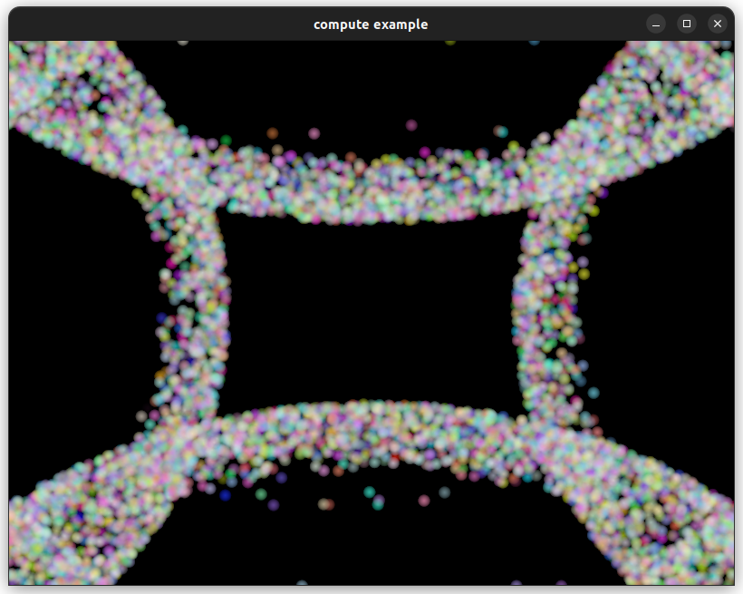
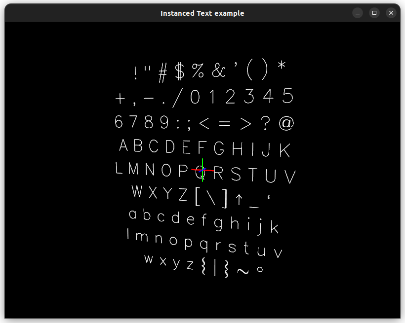
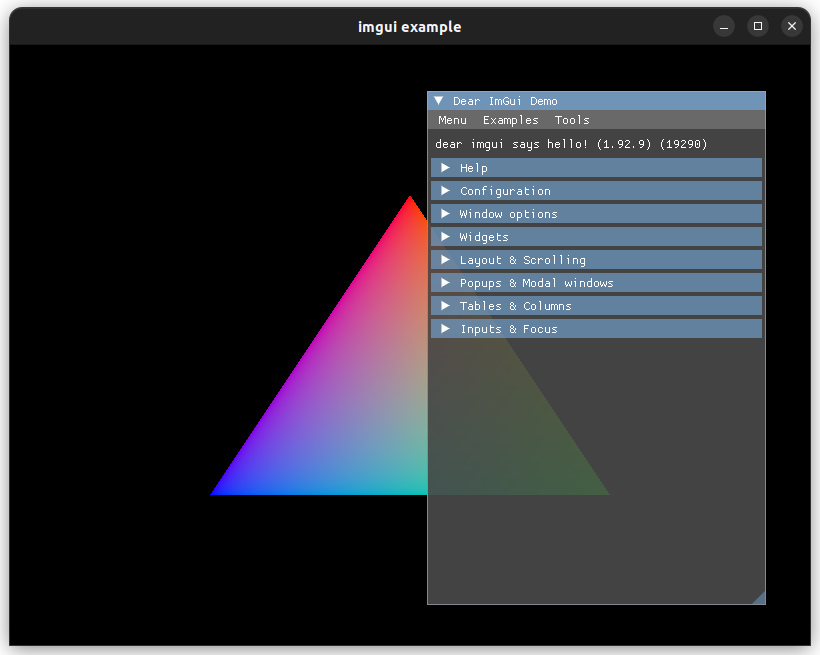

# vk-gfx

A minimal Vulkan framework for rendering and compute.

## Philosophy

Vk-gfx simplifies Vulkan development with a clean, lightweight API centered around parameter structs with sensible defaults. It provides a straightforward starting point while remaining flexible and fully customizable.

Rather than abstracting Vulkan away entirely, the framework stays close to its underlying design and philosophy. It removes much of the boilerplate without taking away control: Vulkan types remain directly accessible and raw Vulkan commands can be used whenever functionality is not (yet) exposed by the API.

## Usage

To include the library in your own project, add the following lines to your CMakeList.txt:
(The library is located in `deps/vk-gfx`, adapt as needed)

```
set(VKGFX_DIR deps/vk-gfx)
add_subdirectory(${VKGFX_DIR})
include_directories(${VKGFX_DIR}/include)

...

target_link_libraries(<your_target> PRIVATE vk-gfx)
```

### Minimal setup

```cpp
#include <vk-gfx.h>

int main()
{
	// window creation (not part of libary)
	std::string appName = "triangle example";
	Window window = create_window(800, 600, appName);

	gfx::Device* device = gfx::create_device({
		.appname = appName,
		.windows = {
			{ .window = window.vkWindow, .swapchain = { .format = VK_FORMAT_B8G8R8A8_SRGB }}
		},
		.enableValidation = true
	});

	gfx::Pipeline* pipeline = gfx::create_graphics_pipeline(device, {
		.vertexShader = load_shader("shaders/triangle.vertex.spv"),
		.fragmentShader = load_shader("shaders/triangle.fragment.spv"),
	});

	while (poll_window_events(window)) {
		const gfx::SwapchainFrame frame = gfx::acquire(device, window.vkWindow);
		gfx::CommandBuffer commands = gfx::begin_commands(frame.window);
		gfx::begin_render_pass(device, commands, &frame);
		gfx::bind_pipeline(pipeline, commands, frame.dynamicState);
		gfx::draw(commands, {}, 3); // mesh verts are defined in shader
		gfx::end_render_pass(commands);
		gfx::end_commands(commands);
		gfx::submit_and_present(device, frame, commands);
	}

	gfx::wait_idle(device);

	gfx::destroy_pipeline(device, pipeline);
	gfx::destroy_window(device, window.vkWindow);
	gfx::destroy_device(device);
	close_window(window);

	return EXIT_SUCCESS;
}
```

## Features

- [x] Device creation:
  - [x] Instance / Device Features
  - [x] Extensions
  - [x] Validation Layers
  - [x] Vulkan API version
  - [x] Command pool sizes
- [x] Graphics pipelines
- [x] Compute pipelines
- [x] Queue requests
- [x] Images:
  - [x] Textures Sampler creation
  - [x] Depth buffers
- [x] Resources:
  - [x] Resource layouts / sets
  - [x] Uniform buffers
  - [x] Structured Buffers
  - [x] Combined samplers
  - [ ] Texture
  - [ ] Sampler
- [ ] Windowing:
  - [x] Windowing library agnostic
  - [x] Swapchain management
  - [x] Rendertarget / Framebuffers
  - [x] Multiple windows
  - [ ] Headless compute / rendering support
- [x] Synchronization (semaphores & fences)
- [x] Renderpass creation
- [x] Push constants
- [x] MSAA
- [x] Drawing:
  - [x] Indexed
  - [x] Instancing
  - [x] Indirect drawing
- [ ] Dynamic state
  - [x] Viewport
  - [x] Scissor
  - [x] Cullmode
  - [x] FrontFace
  - [x] Primitive Topology
  - [ ] Others

## Examples

### Building (CMake)

Examples require GLFW for windowing and GLM for mathematics, make sure CMake can find these on your system.

Run the following commands to build the library + examples:

```
mkdir build
cd build
cmake .. -DVKGFX-BUILD_EXAMPLES=1
```

Building with Make:

```
make -j
```

### Showcase

#### [Triangle](examples/triangle.cpp)



#### [Cube](examples/cube.cpp)



**Features:**

- Indexed Mesh binding
- Depth buffering
- Uniform buffers
- Texture creation and upload
- Resource set creation & binding
- Push Constants
- MSAA

#### [Compute Particles](examples/compute.cpp)



**Features:**

- Compute + Graphics pipeline
- Uniform Buffers
- Storage Buffers
- Advanced Synchronization

### Thirdparty Integration

#### [Text](examples/text.cpp)

(requires [draft-type](https://github.com/JeroenHoogers/draft-type))



**Features:**

- Uniform buffers
- Storage buffers
- Indirect drawing
- Instanced drawing

#### [ImGui](examples/imgui.cpp)

(requires [dear imgui](https://github.com/ocornut/imgui))



## Integrating a custom Windowing system

To integrate with your windowing library of choice, you need to fill a `gfx::WindowCallbacks` struct to provide vk-gfx with the information it needs to find the right surface extensions, create a `VkSurfaceKHR` and query window dimensions.

```cpp
// Alternatively you could pass these directly in the extensions list during device creation
static VkResult glfw_get_required_instance_extensions(std::uint32_t* count, const char** names, void*) {
	std::uint32_t glfw_count;
	const char** glfw_names = glfwGetRequiredInstanceExtensions(&glfw_count);

	for (uint32_t i = 0; i < glfw_count; ++i) {
		names[i] = glfw_names[i];
	}

	return VK_SUCCESS;
};

static VkResult glfw_create_surface(VkInstance instance, VkSurfaceKHR* surface, void* user_data) {
	GLFWwindow* window = (GLFWwindow*)user_data;
	return glfwCreateWindowSurface(instance, window, nullptr, surface);
};

static void glfw_get_framebuffer_size(uint32_t* width, uint32_t* height, void* user_data) {
	GLFWwindow* window = (GLFWwindow*)user_data;
	int w, h;
	glfwGetFramebufferSize(window, &w, &h);
	*width = static_cast<uint32_t>(w);
	*height = static_cast<uint32_t>(h);
};

static void glfw_resize_callback(GLFWwindow* window, [[maybe_unused]] int width, [[maybe_unused]] int height) {
	gfx::Window* gfx_window = reinterpret_cast<gfx::Window*>(glfwGetWindowUserPointer(window));
	gfx_window->swapchain->resized = true;
};

Window create_window(std::uint32_t width, std::uint32_t height, const std::string& title) {

	// ... glfw init ...
	GLFWwindow* glfwWindow = glfwCreateWindow(width, height, title.c_str(), nullptr, nullptr);
	glfwSetFramebufferSizeCallback(glfwWindow, glfw_resize_callback);

	gfx::WindowCallbacks windowCallbacks{
		.get_required_instance_extensions = glfw_get_required_instance_extensions,
		.get_framebuffer_size = glfw_get_framebuffer_size,
		.create_surface = glfw_create_surface,
		.user_data = glfwWindow // provide glfw window pointer to callbacks
	};

	// provide vk window ptr as userdata to glfwWindow for framebuffer resize callback
	gfx::Window* vkWindow = gfx::create_window(windowCallbacks);
	glfwSetWindowUserPointer(glfwWindow, vkWindow);

  //...
}
```

See [examples/glfw_window.cpp](examples/glfw_window.cpp) for more details.

## Todo

- [ ] Custom allocators
- [ ] Device querying / error handling / fallbacks
- [ ] Task / Mesh shaders
- [ ] Offscreen rendering
- [ ] Dynamic rendering (Vulkan>= 1.2)
- [ ] Ray-tracing support
- [ ] User defined dynamic state
- [ ] Multiple render passes
- [ ] Timeline semaphores
- [ ] Async Compute
- [ ] Pipeline Caching

## Acknowledgments

- **Alexander Overvoorde** and **Sascha Willems**: For making the awesome [Vukan Tutorial](https://vulkan-tutorial.com/), which I followed to implement most of the features in this Libary. Also some of the examples are directly inspired by it.
- **Sebastian Aaltonen**: For posting this [image](https://x.com/SebAaltonen/status/2095562458467287266/photo/1) which heavily inspired the API design of this library.
