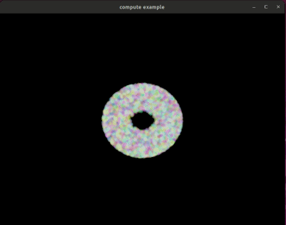

# vk-gfx

A minimal Vulkan framework for rendering and compute.

## Usage:

To include the library in your own project, add the following lines to your CMakeList.txt:
(The library is located in `deps/vk-gfx`, adapt as needed)

```
set(VKGFX_DIR deps/vk-gfx)
add_subdirectory(${VKGFX_DIR})
include_directories(${VKGFX_DIR}/include)

...

target_link_libraries(<your_target> PRIVATE vk-gfx)
```

#### Minimal setup:

```cpp
#include <vk-gfx.h>

int main()
{
	// window creation (not part of libary)
	std::string appName = "triangle example";
	Window window = create_window(800, 600, appName);

	gfx::Device* device = gfx::create_device({
		.appname = appName,
		.windows = {
			{ .window = window.vkWindow, .swapchain = { .format = VK_FORMAT_B8G8R8A8_SRGB }}
		},
		.enableValidation = true
	});

	gfx::Pipeline* pipeline = gfx::create_graphics_pipeline(device, {
		.vertex_shader = load_shader("shaders/triangle.vertex.spv"),
		.fragment_shader = load_shader("shaders/triangle.fragment.spv"),
	});

	while (poll_window_events(window)) {
		const gfx::SwapchainFrame frame = gfx::acquire(device, window.vkWindow);
		gfx::CommandBuffer commands = gfx::begin_commands(frame.window);
		gfx::begin_render_pass(device, commands, &frame);
		gfx::bind_pipeline(pipeline, commands, frame.dynamicState);
		gfx::draw(commands, {}, 3); // mesh verts are defined in shader
		gfx::end_render_pass(commands);
		gfx::end_commands(commands);
		gfx::submit_and_present(device, frame, commands);
	}

	gfx::wait_idle(device);

	gfx::destroy_pipeline(device, pipeline);
	gfx::destroy_window(device, window.vkWindow);
	gfx::destroy_device(device);
	close_window(window);

	return EXIT_SUCCESS;
}
```

## Build and run examples:

### Building with CMake

Run the following commands to build the library + example:

```
mkdir build
cd build
cmake .. -DVKGFX-BUILD_EXAMPLES=1
```

Building with Make:

```
make -j
```

## Features:

- [x] Device creation:
  - [x] Instance / Device Features
  - [x] Extensions
  - [x] Validation Layers
  - [x] Vulkan API version
  - [x] Command pool sizes
- [x] Graphics pipelines
- [x] Compute pipelines
- [x] Queue requests
- [x] Images:
  - [x] Textures Sampler creation
  - [x] Depth buffers
- [x] Resources:
  - [x] Define custom Resource layouts / sets
  - [x] Uniform buffers
  - [x] Structured Buffers
  - [x] Combined samplers
  - [ ] Texture only
  - [ ] Sampler only
- [ ] Windowing:
  - [x] Platform / Windowing library agnostic (examples show glfw)
  - [x] Swapchain management
  - [x] Rendertarget / Framebuffers
  - [x] Multiple windows
  - [ ] Headless compute / rendering support
- [x] Synchronization (semaphores & fences)
- [x] Renderpass creation
- [x] Push constants
- [x] MSAA
- [x] Drawing:
  - [x] Indexed
  - [x] Instancing
  - [x] Indirect drawing
- [ ] Dynamic state
  - [x] Viewport
  - [x] Scissor
  - [x] Cullmode
  - [x] FrontFace
  - [x] Primitive Topology
  - [ ] Custom / user defined

## Examples:

### Triangle

- Window creation
- Device creation
- Graphics Pipeline

  
  _triangle example_

### Cube

- Indexed Mesh binding
- Depth buffering
- Uniform buffers
- Texture creation and upload
- Resource set creation & binding
- Push Constants
- MSAA

  

### Compute Particles

- Compute + Graphics pipeline
- Uniform Buffers
- Structured Buffers
- Advanced Synchronization



### Thirdparty Integrations:

### Text

(requires [draft-type](https://github.com/JeroenHoogers/draft-type))

- Uniform buffers
- Storage buffers
- Indirect drawing
- Instanced drawing


### ImGui

(requires [dear imgui](https://github.com/ocornut/imgui))


## Todo:

- [ ] Custom allocators
- [ ] Offscreen rendering
- [ ] Dynamic rendering (Vulkan>= 1.2)
- [ ] Ray-tracing support
- [ ] User defined dynamic state
- [ ] Timeline semaphores
- [ ] Async Compute
- [ ] Pipeline Caching
